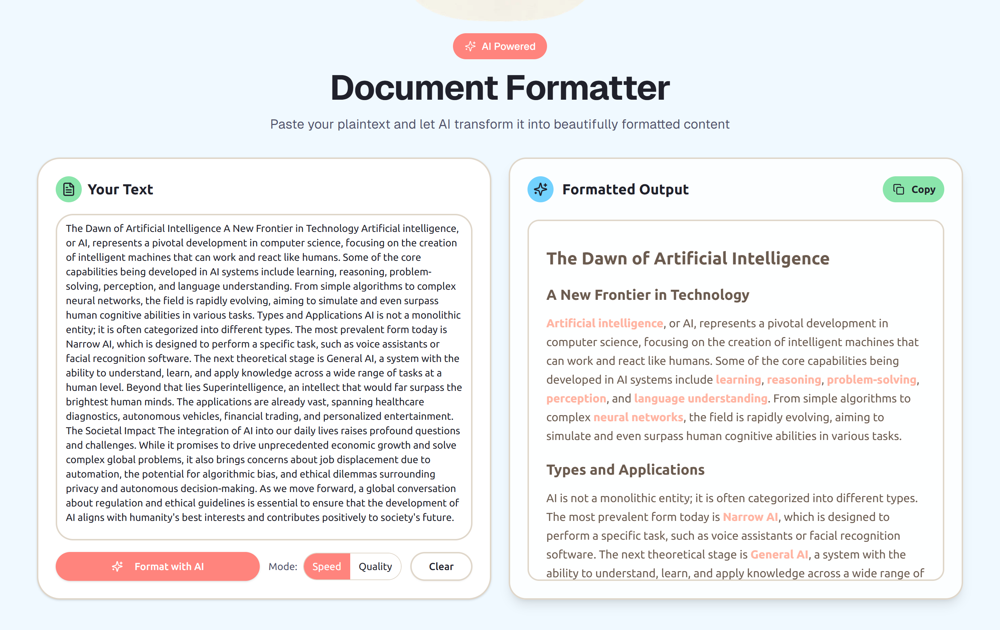

# DeWallify

<div align="center">
  <a href="https://github.com/Creative-Geek/DeWallify">
    
  </a>

  <h3 align="center">DeWallify</h3>

  <p align="center">
    Effortlessly convert walls of text into clean, readable Markdown.
    <br />
    <a href="https://dewallify.creative-geek.tech"><strong>Try it »</strong></a>
    <br />
    <br />
    <a href="https://github.com/Creative-Geek/DeWallify/issues">Report Bug</a>
    ·
    <a href="https://github.com/Creative-Geek/DeWallify/issues">Request Feature</a>
  </p>
</div>

<div align="center">


</div>



## Key Features

- **AI-Powered Formatting**: Automatically transforms unstructured text into well-formatted Markdown.
- **Multiple AI Providers**: Choose from a variety of AI models, including OpenAI, Groq, and Google Gemini.
- **Speed vs Quality switcher**: Toggle between Speed (Cerebras) and Quality (Gemini) directly next to the Format button.
- **Real-Time Streaming**: Watch the formatted text appear in real-time as the AI processes it.
- **Clipboard Integration**: Easily copy the formatted Markdown to your clipboard with a single click.
- **Clean & Modern UI**: A simple, intuitive interface built with Next.js and Shadcn UI.
- **Easy to Customize**: Modify the AI's formatting behavior by editing a single system prompt file.

## Getting Started

Follow these steps to set up the project locally.

### Prerequisites

Make sure you have [Node.js](https://nodejs.org/) and [pnpm](https://pnpm.io/) installed.

### Installation

1. **Clone the repository:**

   ```bash
   git clone https://github.com/Creative-Geek/DeWallify.git
   cd DeWallify
   ```

2. **Install dependencies:**

   ```bash
   pnpm install
   ```

3. **Set up environment variables:**

   Create a `.env.local` file in the root of the project and add your AI provider API keys:

   ```env
   OPENAI_API_KEY=...
   GROQ_API_KEY=...
   GEMINI_API_KEY=...
   CEREBRAS_API_KEY=...
   ```

4. **Run the development server:**

   ```bash
   pnpm dev
   ```

Open [http://localhost:3000](http://localhost:3000) in your browser to see the application.

After pasting the formatted text into Microsoft Word, it retains its structure and readability.


Try it yourself: [DeWallify](https://dewallify.creative-geek.tech)

Here's a random wall of text to try it out:

```text
The Dawn of Artificial Intelligence A New Frontier in Technology Artificial intelligence, or AI, represents a pivotal development in computer science, focusing on the creation of intelligent machines that can work and react like humans. Some of the core capabilities being developed in AI systems include learning, reasoning, problem-solving, perception, and language understanding. From simple algorithms to complex neural networks, the field is rapidly evolving, aiming to simulate and even surpass human cognitive abilities in various tasks. Types and Applications AI is not a monolithic entity; it is often categorized into different types. The most prevalent form today is Narrow AI, which is designed to perform a specific task, such as voice assistants or facial recognition software. The next theoretical stage is General AI, a system with the ability to understand, learn, and apply knowledge across a wide range of tasks at a human level. Beyond that lies Superintelligence, an intellect that would far surpass the brightest human minds. The applications are already vast, spanning healthcare diagnostics, autonomous vehicles, financial trading, and personalized entertainment. The Societal Impact The integration of AI into our daily lives raises profound questions and challenges. While it promises to drive unprecedented economic growth and solve complex global problems, it also brings concerns about job displacement due to automation, the potential for algorithmic bias, and ethical dilemmas surrounding privacy and autonomous decision-making. As we move forward, a global conversation about regulation and ethical guidelines is essential to ensure that the development of AI aligns with humanity's best interests and contributes positively to society's future.
```

## Tech Stack

- **Framework**: [Next.js](https://nextjs.org/)
- **Styling**: [Tailwind CSS](https://tailwindcss.com/)
- **UI Components**: [Shadcn UI](https://ui.shadcn.com/)
- **AI Integration**: [Vercel AI SDK](https://sdk.vercel.ai/)
- **Language**: [TypeScript](https://www.typescriptlang.org/)

## Contributing

Contributions are welcome! Please open an issue to discuss your ideas or submit a pull request.

1. Fork the Project
2. Create your Feature Branch (`git checkout -b feature/AmazingFeature`)
3. Commit your Changes (`git commit -m 'Add some AmazingFeature'`)
4. Push to the Branch (`git push origin feature/AmazingFeature`)
5. Open a Pull Request

## License

Distributed under the MIT License. See `LICENSE` for more information.
